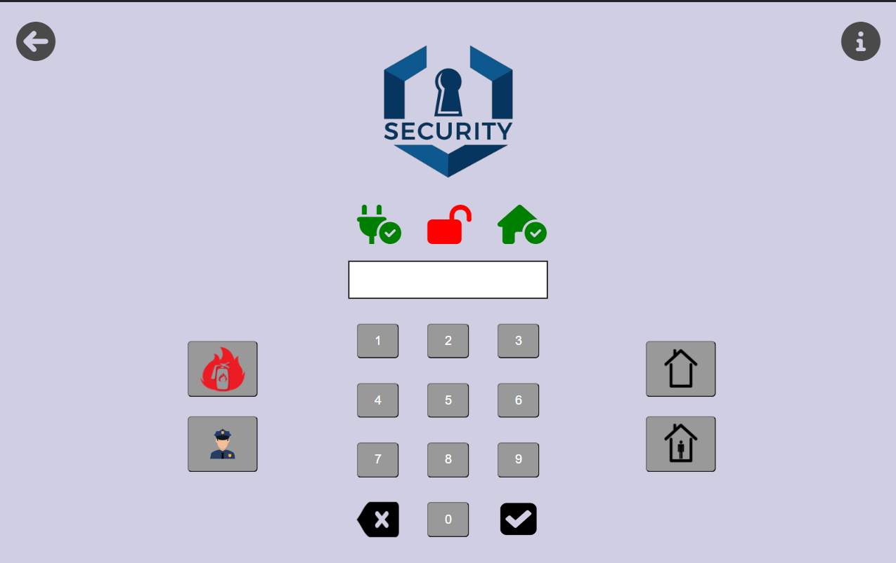

# AUEB
Τhis repository contains some assignments from various courses from university.

## HCI_Project
HCI_Project contains a user-friendly user interface for a security system. This project was made in the context of the computer interaction course, it contains 5 screens and the following programming languages were used: HTML, CSS, Javascript. The final form of the project was formed by the evaluation of different prototypes of the system by user. The main page of the application is shown below.  

## SecureLogin
SecureLogin is a safe login page which prevents an attacker from doing brute force attacks and sql injections. Users are stored in a local MySQL database. This project was done in the context of the course Νetwork Security using the spring boot a java framework.
## SQL_Server_Basics
SQL_Server_Basics contains the basics of microsoft sql server (tables creation, queries, scripts and more). Τhis project was done in the context of the course database design.
## WebBasics
WebBasics includes the basics of HTML, CSS, Javascript, node.js, express. Τhis project was done in the context of the course technologies and programming on the web.